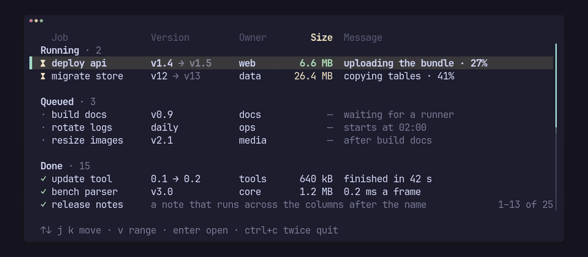

# pito-list

[](https://github.com/gmrdad82/pito-list/actions/workflows/ci.yml)



The list behind the [PITO](https://pitomd.com) terminal apps, as a crate.
Selectable list rows for ratatui apps, in the style of HEY's terminal UI: the
selected row is drawn as a bold "▌ " marker plus its text in the app's selected
style, the other rows as two blank cells plus their cells in their own styles,
and the columns pad to align across rows. It's a ratatui 0.30 widget with no
backend feature, and it has no words of its own: every word, style and key
comes from the app, so any language works.

## Install

It isn't on crates.io; add it from git, pinned to a release tag:

```toml
pito-list = { git = "https://github.com/gmrdad82/pito-list", tag = "v0.7.0" }
```

Turn on the `crossterm` feature for `Key::from(crossterm::event::KeyEvent)`
(crossterm 0.29); without it the crate has no backend dependency. The
conversion turns Alt, Super, Meta or Hyper on a non-character key into
`Key::Other`, keeps Alt apart on a character (`Key::Alt('y')`), and passes
Ctrl+Alt plus a character on as that character, which is how AltGr arrives on
some platforms, so diacritics can still be typed.

## Try it

```sh
cargo run --example demo --features crossterm
```

The demo is the clip above: sample jobs in three sections under a styled
header, sizes that grow and warm in place, the view following the selection
as it scrolls, `v` for a range, `g` and `G` for the ends, enter to open and
`q` to quit. Its recording is kept in `render/`.

## What it does

- **Rows.** A `Row` is a list of `Cell`s, each with a text and a style (the
  app's ink by default, `faint()` for secondary text, or `style(..)` for its
  own), and an optional leading `Mark` such as a state sign. Marks align: the
  widest mark sets one column for the whole list.
- **Cells of several parts.** `Cell::parts(..)` builds one cell from `Part`s,
  each with its own style (a part without one takes the cell's), so a name can
  be followed by a faint suffix. The parts pad, align and clip as one cell: a
  text wider than the column ends in "…" in the style of the part it cuts.
- **Cells that take the rest of the row.** `rest()` draws a cell from its
  column to the end of the row as one clipped cell, over the columns after it;
  the row's later cells are not drawn. It takes its column's alignment and
  drops with its column (pin the column to keep it).
- **Sections.** `Row::heading(parts)` is a line drawn across the row from
  where the marks start, in its parts' own styles (a bold title and a faint
  count, say), and `Row::blank()` is an empty separator line. Neither can be
  selected: the cursor, the keys, paging, `select` and `hit` skip them, and a
  list of sections only has no selection. They scroll with the rows, and when
  the view follows the selection up to the first row of a group, the group's
  heading comes into view above it.
- **The selected row** is drawn whole in the app's selected style (bold accent,
  say), across the full width, behind a "▌ " marker; cell and mark styles give
  way to it. `cursor(..)` replaces the marker text.
- **A marker in its own style.** `Styles::cursor(style)` draws the marker in
  that style instead of the selected one, so a list that keeps its cell colours
  under a bold-only selected style can still colour the marker. It is drawn
  over the selected line, so what it leaves unset (a background, say) comes
  from the selected style and the base; remove a modifier with the style's own
  `remove_modifier`. Unset, the marker takes the selected style as before.
- **A selected range** for Visual and line-Visual modes:
  `select_range(Some((from, to)))` draws every selectable row from `from` to
  `to` (in either order, both included) in the selected style across the row,
  just like the selected row. The marker stays on the selected row alone, so
  the cursor still shows inside the range. Sections inside the range draw as
  sections, and `None` (the default) goes back to the one selected row. The
  range is the app's: keys, paging, `select`, `set_rows`, `update` and `clear`
  leave it as set, only `select_range` changes it, and rows it names past the
  end are simply not there to draw.
- **Cell colours kept on the selected rows.** `Styles::keep_colours(true)`
  patches the selected style over each cell's, part's and mark's own style
  instead of replacing it, on the selected row and on the range: a selected
  style of a background and bold keeps a red number red and a faint note
  faint. Whatever the selected style sets still wins (a foreground it sets
  colours every cell). It is off by default.
- **Columns** have a title, a minimum and a preferred width, and a drop
  priority. Each one pads to its width so the rows align. When the width runs
  out the highest `priority(n)` drops first (the later column on a tie), a
  `pinned()` column drops never, and a column that is left shrinks no
  further than its minimum. Spare width goes to the columns up to their
  preferred widths, left to right.
- **Columns that fit their cells.** `fit(max)` sizes a column to its widest
  cell among the rows on screen (and its title, when the header is drawn), up
  to `max`: at each draw that width stands in for the preferred one, so the
  column still keeps its minimum, takes spare width left to right with the
  others and drops by its priority, and a cell wider than it gets is clipped
  with "…". Only the rows the draw shows are measured, so the width follows the
  view as the list scrolls. Headings, blank rows and `rest()` cells (and the
  cells after one) don't count, and a fit on the flexible column changes
  nothing, since that column takes what's left. With a lazy `Source`, the rows
  on screen are asked for twice in a draw when a column fits, once to measure
  and once to draw; no other row is.
- **Where the columns were drawn.** After a draw, `List::columns()` lists each
  column drawn as `(column index, x, width)` in terminal cells, left to right:
  the x the column's cells start at and the width they pad to, clipped to the
  area. A dropped column, or one the area has no room left for, is absent;
  before the first draw the list is empty. With `top()`, it places a widget
  over one cell: row `index` is on line `area.y + header + index - top()`. It
  is kept in the list, so reading it allocates nothing.
- **Right-aligned columns.** `right()` pads a column on the left instead of the
  right, for numbers: its cells and its header title end at the column's right
  edge. A text wider than the column is clipped with "…" just as in a
  left-aligned one.
- **Drawn inside its area only.** Every cell the list writes (the rows, the
  header, the marker, the marks, the end and empty lines) is clipped to the
  area it is drawn in, not to the buffer, so a list beside a detail pane never
  draws over it. When the pinned columns' minimums don't fit the area, a row is
  cut at the area's right edge with "…", and a right-aligned column at that
  edge ends its cells there, just as at the buffer's edge: a list draws the same
  in part of a buffer as in a buffer of its own.
- **The flexible column takes what's left** (a message, say), is never
  dropped and is clipped with "…". Its minimum is always kept free, and its
  preferred width isn't used. It is the last column unless one is marked
  `flex()` (the first so marked wins), so number columns can follow a wide
  name column.
- **A list** (`List`) holds the rows, the selection and the scroll offset. The
  offset keeps the selection in view when the list is drawn, and an end line
  scrolls in with the last row; when one line is all there is, the selected
  row wins over the end line. `page_up`/`page_down` move by the drawn page
  (one less than the rows on screen), `first`/`last` jump.
- **Paging that keeps the view still.** By default (`Paging::Cursor`) paging
  moves the selection and the view follows it. With `paging(Paging::View)` the
  view moves by the same rows as the selection, so the selection stays on its
  screen line until the list's start or end stops the view. `scroll_to(top)`
  moves the offset itself; the next draw still keeps the selection in view.
- **Lazy rows.** `List::from_source(source)` takes any `Source`: a length and
  a row by index (`Cow::Owned` for a row built on demand, `Cow::Borrowed` for
  one it holds), so a list of tens of thousands of entries builds only the
  rows on screen and the few above the selection it checks for a heading. A
  source may answer `selectable(index)` without building the row, and names
  the mark column's width with `mark_width()` (none by default), since the
  list can't look at every row's mark. `update(..)` changes the source in
  place and `set_source(..)` replaces it; both clamp the selection. The owned
  rows of `List::new()` are themselves a source (`Vec<Row>`).
- **Shared vectors, rows built on demand.** `Shared::new(items, builder)` is a
  ready source over an `Arc<Vec<T>>` of the app's own items (jobs, pings, log
  lines): the builder turns one item into a `Row` only when a draw or a key
  asks for it, so a list of tens of thousands of items builds only the rows on
  screen, with pinned and priority columns, sections, the end line and the
  empty text like any other list. The builder is a closure
  `|index, item: &T| -> Row`, or a type of the app's that implements
  `Build<T>`, which names the list's type in a struct field
  (`List<Shared<Job, Cells>>`, or `List<Shared<Job>>` with a plain `fn`),
  holds what the rows are built with (the columns that fit this width, a
  clock) and may answer `selectable` without building the row.
  `set_items(..)` hands over a new vector for the cost of an `Arc` clone and
  `builder_mut()` changes the builder's state; through `update(..)`, either
  keeps the selection on its index, clamped. Name the mark column's width with
  `marks(width)` or `set_marks(width)` (none by default), since no row is built
  to find it.
- **Shared rows.** Rows the app has already built can be shared as they are:
  `Arc<Vec<Row>>` and `Arc<[Row]>` are sources too. They lend their rows like
  the owned `Vec<Row>` and, like it, scan the rows' marks once when handed over,
  so handing the list a clone of the `Arc` every frame copies no row and
  allocates nothing.
- **An optional header line** of the column titles, an optional end line (the
  app's words, say "· end ·") after the last row, and an optional line for an
  empty list, all in the faint style.
- **A header in the app's styles.** `Styles::header(style)` draws the column
  titles in that style instead of the faint one and paints it across the whole
  header line, gaps and marker cells included, so the header can't pass for a
  row. `Styles::header_key(style)` with `ListView::key_column(Some(index))`
  draws one column's title (the one the list sorts by, say) in the key style,
  over the header line; a dropped column shows no key. Without them the header
  draws as before.
- **A base style.** Drawing clears every cell of its area to the app's base
  style (none by default, so the terminal's own background shows), so an app
  that paints a page background keeps it under the list: in the column gaps,
  the padding, the two marker cells of the other rows and the lines below the
  end. Every other style is drawn over it, and the selected row's style wins
  on its row: the base shows through only what the selected style leaves
  unset.
- **Rows rewritten in place.** `List::row_mut(index)` hands out one of the
  owned rows, `Row::cells_mut()` and `Row::leading_mut()` reach its cells and
  mark, and `Cell::set_text`, `Cell::set_part` and `Mark::set_text` write into
  the strings already there, so a frame that rewrites a counter and draws
  allocates nothing once the strings have grown to their texts. The mark column
  follows a rewritten mark, wider or narrower, at the next draw, which scans
  the rows once, and only when a widest mark narrowed. `set_text` makes a cell of parts one
  part in the cell's style; `set_part(index, text)` rewrites one part (a
  heading's count, say), keeps every part's style, and answers `false` for a
  part that isn't there (a plain cell is one part).
- **Styles changed in place.** `Cell::set_style(style)`,
  `Cell::set_part_style(index, style)` and `Mark::set_style(style)` recolour a
  cell, one part or a mark between draws (a number drawn warmer as it rises,
  say) and leave its text and buffers alone, so they allocate nothing either.
  A style set this way replaces the paint that was there: the ink a cell or
  mark takes by default and `faint()` both stand for the list's
  `Styles::ink` and `Styles::faint` at each draw, while an explicit style
  (set here or with `style(..)`) draws as given over the base, whatever those
  say. To go back to the look of ink or faint, set the style the list's
  `Styles` gives them. On a cell of parts, `set_style` is the style of every part without its own, as with
  `Cell::parts(..).style(..)`; a part's own style stays. `set_part_style`
  restyles one part, replacing its own style or its `faint()`, and answers
  `false` for a part that isn't there; a plain cell is one part, at index 0,
  where it sets the cell's style. The selected row and the range draw a
  restyled cell like any other: in the selected style, or with the selected
  style patched over it under `keep_colours(true)`.
- **Keys in, steps out.** `List::key(Key)` takes the crate's own `Key` and
  returns a `Step`: `Moved`, `Held` (a list key that moved nothing, such as up
  on the first row), `Open(index)` for the open key, or `Pass` for a key that
  isn't the list's. It never reads input itself. The keys are the app's:
  `Keys::new()` is the arrows, page keys, home, end and enter, `Keys::VIM` adds
  j/k, g/G and ctrl+u/ctrl+d, and any set can be replaced.
- **Clicks.** `List::hit(area, header, column, row)` names the row under a
  terminal cell, following the scroll, or `None` for the header, a section,
  the end line or a blank line.
- **Widths by cell.** Unicode widths throughout, so diacritics (ă, î, ș, ț),
  "…" and wide glyphs measure, pad and clip cleanly; a wide glyph is never cut
  in half. A newline, tab or carriage return inside a text is drawn as one
  space, other control characters are dropped, and every sum saturates.
- **Cheap.** Drawing writes straight into the buffer and allocates nothing
  beyond what a lazy source's own rows do; a 20,000-row list at 150×40 draws
  in about 0.2 ms, and so does a lazy 100,000-row list in groups, a shared
  100,000-item vector built on demand and handed over every frame, and the
  owned list with a range, kept colours, a styled header and rows rewritten
  every frame; with four columns that fit their cells it takes about 0.26 ms
  (`cargo run --release --example bench`). Only the rows on screen are
  visited.

## The API

```text
pub enum Key { Char(char), Ctrl(char), Alt(char), Tab, BackTab, Enter, Esc, Backspace,
               Left, Right, Up, Down, Home, End, PageUp, PageDown, Delete, Other }   // non_exhaustive
pub struct Styles { selected, ink, faint, base, header, header_key, cursor, keep }   // non_exhaustive
  Styles::new(); .selected(Style) .ink(Style) .faint(Style) .base(Style)
                 .header(Style) .header_key(Style) .cursor(Style) .keep_colours(bool)
Part::new(text) | From<&str> | From<String>;  .faint() .style(Style); text()
Cell::new(text) | Cell::parts(parts) | From<&str> | From<String>;
                                              .faint() .style(Style) .rest(); text()
  set_text(&str), set_part(index, &str) -> bool, set_style(Style), set_part_style(index, Style) -> bool
Mark::new(text);                              .faint() .style(Style); text(), set_text(&str), set_style(Style)
Row::new(cells).mark(Mark) | Row::heading(parts) | Row::blank();
  cells(), cells_mut() -> &mut [Cell], leading(), leading_mut() -> Option<&mut Mark>, selectable()
Column::new(title, min, preferred).priority(u8).pinned().right().flex().fit(max: u16)
pub struct Keys { up, down, page_up, page_down, first, last, open: &'static [Key] }   // non_exhaustive
  Keys::new(), Keys::VIM; .up(..) .down(..) .page_up(..) .page_down(..) .first(..) .last(..) .open(..)
pub enum Step { Pass, Held, Moved, Open(usize) }                                      // non_exhaustive
pub enum Paging { Cursor, View }                                                      // non_exhaustive
pub trait Source {
  fn len(&self) -> usize;  fn row(&self, index: usize) -> Cow<'_, Row>;
  fn is_empty(&self) -> bool;  fn selectable(&self, index: usize) -> bool;  fn mark_width(&self) -> u16;
}                                              // the last three have defaults; Vec<Row>,
                                               // Arc<Vec<Row>>, Arc<[Row]> and Shared implement it
pub trait Build<T> {
  fn row(&self, index: usize, item: &T) -> Row;  fn selectable(&self, index: usize, item: &T) -> bool;
}                                              // selectable has a default; every Fn(usize, &T) -> Row is one
pub struct Shared<T, B = fn(usize, &T) -> Row> // a Source over Arc<Vec<T>>, rows built by B when asked
Shared::new(Arc<Vec<T>>, builder).marks(u16)
  items(), set_items(Arc<Vec<T>>), builder(), builder_mut(), set_marks(u16)
pub struct List<S = Vec<Row>>
List::new().keys(Keys).paging(Paging).with_rows(rows)          // List<Vec<Row>>
  set_rows(rows), push(row), clear(), rows(), selected_row(), row_mut(index) -> Option<&mut Row>
List::from_source(source).keys(Keys).paging(Paging)             // List<S> for any S: Source
  source(), set_source(source), update(|source| ..)
  len(), is_empty(), selected() -> Option<usize>, select(index), top(), scroll_to(top), page()
  columns() -> &[(usize, u16, u16)]           // (column index, x, width) of each column drawn
  select_range(Option<(usize, usize)>), range() -> Option<(usize, usize)>
  up(), down(), page_up(), page_down(), first(), last() -> Step
  key(Key) -> Step
  hit(area, header, column, row) -> Option<usize>
ListView::new(&mut List<S>, &[Column])         // Widget
  .styles(Styles).cursor(&str).gap(u16).header(bool).key_column(Option<usize>)
  .end(Option<&str>).empty(Option<&str>)
pub const CURSOR: &str;                        // "▌ ", the default marker
pub const MAX_COLUMNS: usize;                  // 32; a column past it is ignored
```

`Styles`, `Part`, `Cell`, `Mark`, `Row`, `Column`, `Keys`, `Key`, `Step` and
`Paging` are `#[non_exhaustive]`: match enums with a wildcard arm and build the structs
with their constructors and methods, so a later release can add to them in a
minor version.

Drawing takes `&mut List` because it moves the scroll offset to keep the
selection in view; `page()`, `columns()` and `hit` answer for the last draw. Replace the
rows with `set_rows` when the data changes: the selection stays on its index,
clamped to the new length, and moves to the nearest row when that index is a
section. A source changed with `update` or `set_source` does the same. The
range stays as set either way. To change a few texts or styles of the owned
rows, rewrite them in place with `row_mut` (or every row with `update`)
instead.

## Example

```rust,standalone_crate
use std::{borrow::Cow, fmt::Write, sync::Arc};

use pito_list::{
    Build, Cell, Column, Key, List, ListView, Mark, Paging, Part, Row, Shared, Source, Step,
    Styles,
};
use ratatui::{
    Frame,
    layout::Rect,
    style::{Color, Modifier, Style},
};

const BOLD: Style = Style::new().add_modifier(Modifier::BOLD);

const COLUMNS: [Column; 5] = [
    Column::new("Operation", 10, 18).pinned(),
    Column::new("Version", 8, 12).priority(2),
    Column::new("Owner", 5, 10).priority(1),
    Column::new("Size", 4, 8).priority(3).right(),
    Column::new("Message", 8, 0),
];

const FILES: [Column; 3] = [
    Column::new("Name", 8, 0).flex(),
    Column::new("Size", 4, 0).right().fit(10),
    Column::new("Lines", 5, 6).right(),
];

fn rows() -> Vec<Row> {
    let done = Style::new().fg(Color::Green);
    vec![
        Row::heading([Part::new("Running").style(BOLD), Part::new(" · 1").faint()]),
        Row::new([
            Cell::new("deploy api"),
            Cell::parts([Part::new("v1"), Part::new(" → v2").faint()]),
            Cell::new("billing"),
            Cell::new("12 MB").style(Style::new().fg(Color::Red)),
            Cell::new("uploading the bundle"),
        ])
        .mark(Mark::new("⧗").style(Style::new().fg(Color::Yellow))),
        Row::blank(),
        Row::heading([Part::new("Done").style(BOLD), Part::new(" · 2").faint()]),
        Row::new(["update tool", "0.1 → 0.2", "tools", "640 kB", "finished"])
            .mark(Mark::new("✓").style(done)),
        Row::new([
            Cell::new("release"),
            Cell::new("a note that runs across the columns after the name").faint().rest(),
        ])
        .mark(Mark::new("✓").style(done)),
    ]
}

struct Files {
    names: Vec<String>,
}

impl Source for Files {
    fn len(&self) -> usize {
        self.names.len()
    }

    fn row(&self, index: usize) -> Cow<'_, Row> {
        let name = &self.names[index];
        Cow::Owned(Row::new([
            name.clone(),
            format!("{} kB", name.len()),
            format!("{}", index * 3),
        ]))
    }
}

const JOBS: [Column; 2] = [
    Column::new("Job", 8, 24).pinned(),
    Column::new("Size", 4, 0).right(),
];

struct Job {
    name: String,
    bytes: u64,
}

struct Cells {
    unit: &'static str,
    shift: u32,
}

impl Build<Job> for Cells {
    fn row(&self, _: usize, job: &Job) -> Row {
        Row::new([job.name.clone(), format!("{} {}", job.bytes >> self.shift, self.unit)])
    }

    fn selectable(&self, _: usize, _: &Job) -> bool {
        true
    }
}

fn jobs(frame: &mut Frame, list: &mut List<Shared<Job, Cells>>, jobs: &Arc<Vec<Job>>, area: Rect) {
    list.update(|shared| shared.set_items(Arc::clone(jobs)));
    let view = ListView::new(list, &JOBS)
        .header(true)
        .end(Some("· end ·"))
        .empty(Some("No jobs yet."));
    frame.render_widget(view, area);
}

fn key(list: &mut List, key: Key) -> Option<usize> {
    match list.key(key) {
        Step::Open(index) => Some(index),
        _ => None,
    }
}

fn visual(list: &mut List, anchor: Option<usize>) {
    list.select_range(anchor.zip(list.selected()));
}

fn tick(list: &mut List, index: usize, size: &mut String, bytes: u64) {
    size.clear();
    let _ = write!(size, "{} MB", bytes >> 20);
    let warm = if bytes >> 20 > 10 { Color::Red } else { Color::Yellow };
    if let Some(row) = list.row_mut(index) {
        if let Some(cell) = row.cells_mut().get_mut(3) {
            cell.set_text(size);
            cell.set_style(Style::new().fg(warm));
        }
        if let Some(mark) = row.leading_mut() {
            mark.set_text("✓");
            mark.set_style(Style::new().fg(Color::Green));
        }
    }
}

fn draw(frame: &mut Frame, list: &mut List, files: &mut List<Files>, sort: usize) {
    let styles = Styles::new()
        .selected(Style::new().bg(Color::DarkGray).add_modifier(Modifier::BOLD))
        .faint(Style::new().add_modifier(Modifier::DIM))
        .base(Style::new().bg(Color::Black))
        .header(Style::new().fg(Color::Gray).bg(Color::Indexed(236)))
        .header_key(Style::new().fg(Color::Yellow).add_modifier(Modifier::BOLD))
        .cursor(Style::new().fg(Color::Yellow))
        .keep_colours(true);
    let area = frame.area();
    let half = area.height / 2;
    let above = Rect { height: half, ..area };
    let below = Rect { y: area.y + half, height: area.height - half, ..area };
    let view = ListView::new(list, &COLUMNS)
        .styles(styles)
        .header(true)
        .key_column(Some(sort))
        .end(Some("· end ·"))
        .empty(Some("Nothing yet."));
    frame.render_widget(view, above);
    frame.render_widget(ListView::new(files, &FILES).styles(styles).header(true), below);
    if let (Some(at), Some(&(_, x, width))) = (files.selected(), files.columns().get(1)) {
        let line = below.y + 1 + u16::try_from(at.saturating_sub(files.top())).unwrap_or(0);
        frame.buffer_mut().set_style(Rect::new(x, line, width, 1), Style::new().fg(Color::Cyan));
    }
}

fn click(list: &List, area: Rect, column: u16, row: u16) -> Option<usize> {
    list.hit(area, true, column, row)
}

fn main() {
    let mut list = List::new().paging(Paging::View).with_rows(rows());
    assert_eq!(list.selected(), Some(1));
    key(&mut list, Key::Down);
    assert_eq!(list.selected(), Some(4));
    click(&list, Rect::new(0, 0, 80, 10), 3, 2);
    visual(&mut list, Some(1));
    assert_eq!(list.range(), Some((1, 4)));
    let mut size = String::with_capacity(16);
    tick(&mut list, 1, &mut size, 13 << 20);
    assert_eq!(list.rows()[1].cells()[3], Cell::new("13 MB").style(Style::new().fg(Color::Red)));
    visual(&mut list, None);
    let names = (0..50_000).map(|n| format!("file-{n}.txt")).collect();
    let mut files = List::from_source(Files { names });
    files.update(|files| files.names.push("new.txt".to_string()));
    files.scroll_to(100);
    assert_eq!(files.len(), 50_001);
    let all: Arc<Vec<Job>> = Arc::new(
        (0..30_000)
            .map(|n| Job { name: format!("job {n}"), bytes: n << 20 })
            .collect(),
    );
    let mut table = List::from_source(Shared::new(Arc::clone(&all), Cells { unit: "kB", shift: 10 }));
    table.update(|shared| *shared.builder_mut() = Cells { unit: "MB", shift: 20 });
    table.select(29_999);
    assert_eq!(table.selected(), Some(29_999));
    assert_eq!(table.source().row(7).cells()[1], Cell::new("7 MB"));
}
```

## Development

`bin/gate` runs `cargo fmt --check`, `cargo clippy --all-targets
--all-features -- -D warnings`, every test with `cargo nextest` (the tests
draw into ratatui buffers, and a counting allocator holds that a warm frame
allocates nothing), this README's example as a doctest, and the release build
of the bench example. `bin/gate --fast` leaves the bench build out, and CI
runs it on every push and pull request to main.

## Contributing

Issues and pull requests are welcome. Please read the
[code of conduct](CODE_OF_CONDUCT.md) first. A change keeps `bin/gate` green
with no warnings, keeps a warm frame free of allocations, and leaves every
word, style and key to the app. Report a security issue privately, as
[SECURITY.md](SECURITY.md) says, not in a public issue.

## Licence

The code is MIT licensed, © Catalin Ilinca: see [LICENSE](LICENSE). The MIT
grant covers the code only: the PITO name and its logos are © Catalin Ilinca,
all rights reserved, and are not covered by it. The look is in the style of
HEY's terminal UI; see [NOTICE.md](NOTICE.md).
